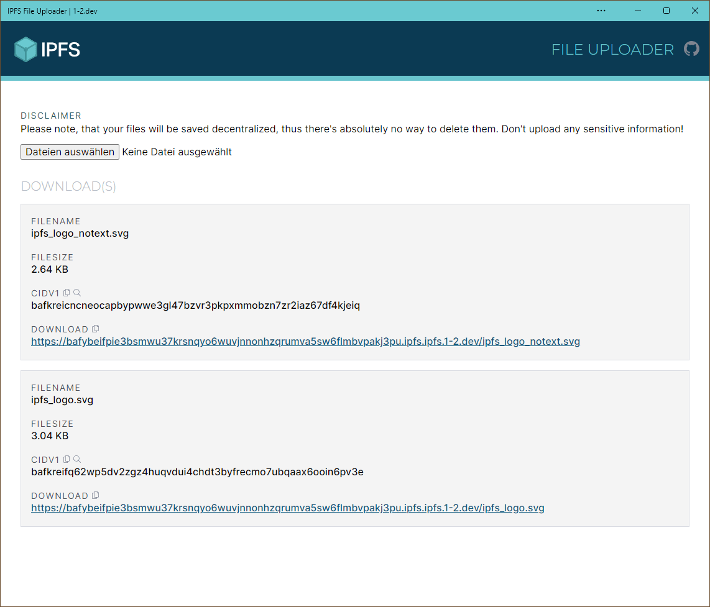

# IPFS File Uploader
#### A website for uploading files to IPFS

<div align="center">

<a href="#installation"> Installation</a> • <a href="#usage"> Usage</a> • <a href="#contributing"> Contributing</a> • <a href="#license-"> License</a>



</div>

---

## Prerequisites

- Node 14+
- Yarn

## Installation

1. Clone this repo:

```bash
git clone https://github.com/SoftCreatR/ipfs-file-uploader
```

2. cd into project directory

```bash
cd ipfs-uploader
```

3. Install dependencies:

```bash
yarn install
```

## Usage

### Dev

```bash
yarn dev
```

### Build

```bash
yarn build
```

### Deploy (to IPFS)

```
yarn deploy
```

#### Linux users

If you see `Error: ENOSPC: no space left on device` errors, crank up your max inotify watches:

```
sysctl -w fs.inotify.max_user_watches=524288
echo "fs.inotify.max_user_watches=524288" >> /etc/sysctl.conf
```

## Contributing

If you have any ideas, just open an issue and describe what you would like to add/change.

If you'd like to contribute, please fork the repository and make changes as you'd like. Pull requests are warmly welcome.

## License 🌳

[ISC](LICENSE.md) © [1-2.dev](https://1-2.dev)

This package is Treeware. If you use it in production, then we ask that you [**buy the world a tree**](https://ecologi.com/softcreatr?r=61212ab3fc69b8eb8a2014f4) to thank us for our work. By contributing to the ecologi project, you’ll be creating employment for local families and restoring wildlife habitats.
